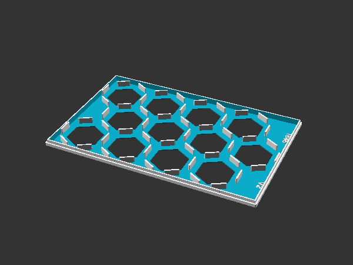
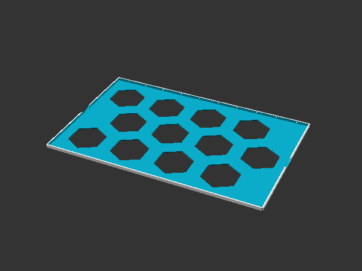
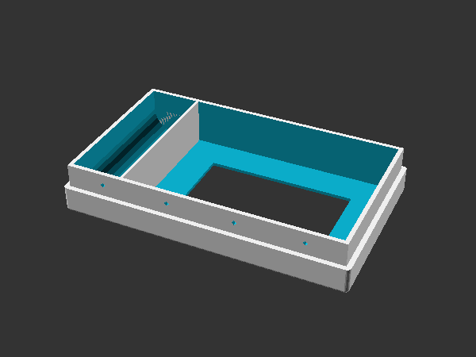
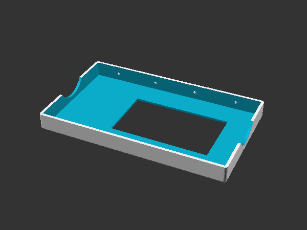
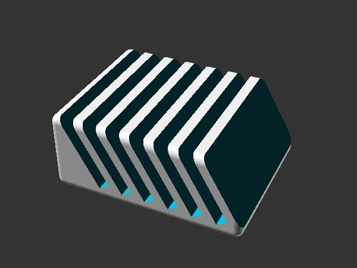

# 18XX Component Boxes

18xx is the collective term used to describe a set of railroad-themed stock market and tile laying games. This is a set of OpenSCAD files and scripts that can be used to easily design boxes to organize the tiles and other components for 18XX-style games.

## Complete Games

| Abbreviation | Game (Variant) |
| --- | --- |
| 1830ah | 1830: The Game of Railroads and Robber Barons (Avalon Hill 1986) |
| 1830lo | 1830: Railways and Robber Barons (Lookout 2018) |
| 1846 | 1846: The Race for the Midwest (GMT) |
| 1867aag | 1867: The Railways of Canada (All Aboard Games) |

## Games in Progress

| Abbreviation | Game (Variant) |
| --- | --- |
| 1822 | 1822: The Railways of Great Britain |
| 1867gtg | 1867: The Railways of Canada (Grand Trumk Games) |
| steam | Steam / Steam Barons |

## Using the Existing Models

These models were designed using [OpenSCAD](http://www.openscad.org/). If you want to create your models, you will need to [install OpenSCAD](http://www.openscad.org/downloads.html) and update the [Makefile](Makefile) with the address of the OpenSCAD executable.

### Download / Clone the Git repository

Follow the instructions from GitHub to create a local copy of the `game-parts` repository.

### Command line options

_GNU Make_ is used to run OpenSCAD from the command line to generate models (STL) and pictures (PNG) for a game.

Override `PREFIX` on the command line to select the parts to produce.
> make all PREFIX=1846
> make all PREFIX=steam

To list all available game prefixes:
> make list

To build all files for every game:
> make everything

To build all BOMs for every game:
> make all-boms

To clean (remove) all generated files for one game
> make 

### Directory Structure

| Directory | Usage |
| --- | --- |
| top-level | README files and OpenSCAD sources |
| util | Link to OpenSCAD utility files |
| stl/_game_ | Generated STL models |
| png/_game_ | Generated PNG pictures of models |
| photos/_game_ | Photographs of printed models |
| bom | Generated Markdown snippets for creating Bill of Material lists |
| docs | Other useful documents |

## Available Components

* **Hex Boxes**
  Hex boxes (and their lids) are intended to store the hexagonal tiles that represent track in these games. A hex box will have walls to separate out stacks of tiles, and a hexagonal hole in the bottom of each stack to assist in removing tiles.  
  
  The lid will also have hexagonal holes to reveal the tiles. The lid may have a set of stubs that will engage with the walls in the box, to keep tiles from shifting around when the box is closed.  
  

* **Card Boxes**
  Card boxes (and their lids) are intended to store the stock shares for companies, and their associated tokens (market tokens, station tokens, etcetera). The box will have a narrow rack to hold the tokens, and a larger bin to hold the cards themselves. The box will have a rectangular hole in the bottom to assist in removing the cards.  
  
    The lid will also have a rectangular hole, to reveal the cards.  
  

* **Card Rack**
  A card rack is a small rack intended to display shares or trains.  
  
  
* **Rounded Box**
  A rounded box is a base component for making other more complex components.

* **Cell Box**
  A cell box is a rounded box that has been divided up into multiple cells that can hold parts.

## Creating Models for a New Game

To create models for a new game, you will need measurements of the game and its components:

| Measurements | Parameters | Notes |
| --- | --- | --- |
| Inside dimensions of the box | height, width | It would be nice to know how much vertical space there is to work with, but I try to make the trays as thin as possible. Either way, the trays need to fit in the box to be useful. |
| Size of the tiles | diameter, thickness | The diameter of the hexagon is the distance between two opposite corners. This will dictate how many tile stacks fit into a tray. |
| Distribution of tiles | manifest | I need to know the maximum number of tiles in a stack (or if I need to allow for several stacks for a type of tile). Sometimes I will group several related tiles into a single stack. |
| Size of the tokens | diameter, thickness, quantity | If you want a box for station and market tokens, then I need to know how big the tokens are, and how many of each type there are. |

As an example, the Avalon Hill version of 1830 has 46 types of tiles, the tiles are ~0.5mm thick, and there are at most 8 tiles of one type (#8). The tile diameter is 46mm, and the box is 11 1/8" x 8". A typical 3D printer will print ~8" square, so that suggests printing trays that are half the size of the box. I can fit 12 tile stacks into that size tray, so we need 4 trays, and the trays will be 8" long, 5 1/4" wide, and 1cm tall.

### Notes for Measurements

1. For measuring tiles and tokens, use digital calipers.
1. Measure boxes along the sides, not across the middle, because boxes bow with use and time.
1. To measure the tile thickness, take a stack of 20 tiles, measure the thickness of the stack and divide by 20.
1. Sometimes the measurements make more sense in Metric units, other times English units will be better. (The AH tiles might actually be 1 13/16" in diameter.)
1. Sometimes the measurements make more sense when measuring from one face to the opposite face. In this case, divide your measurement by the sin(60). (The AH tiles might actually be 1 9/16" across).

## License

This work is licensed under a [Creative Commons Attribution-NonCommercial-ShareAlike 4.0 International License](http://creativecommons.org/licenses/by-nc-sa/4.0/).

The 18XX Tray Library is © 2018-2019 by W. Craig Trader. All other rights reserved.