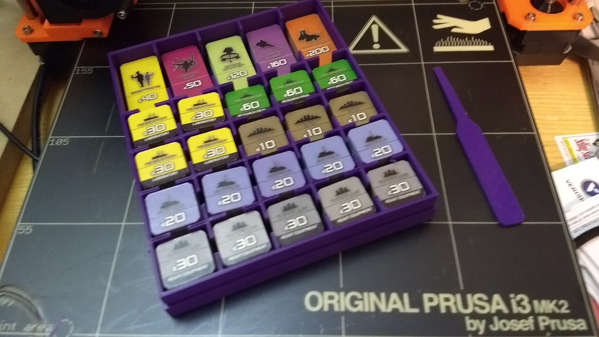
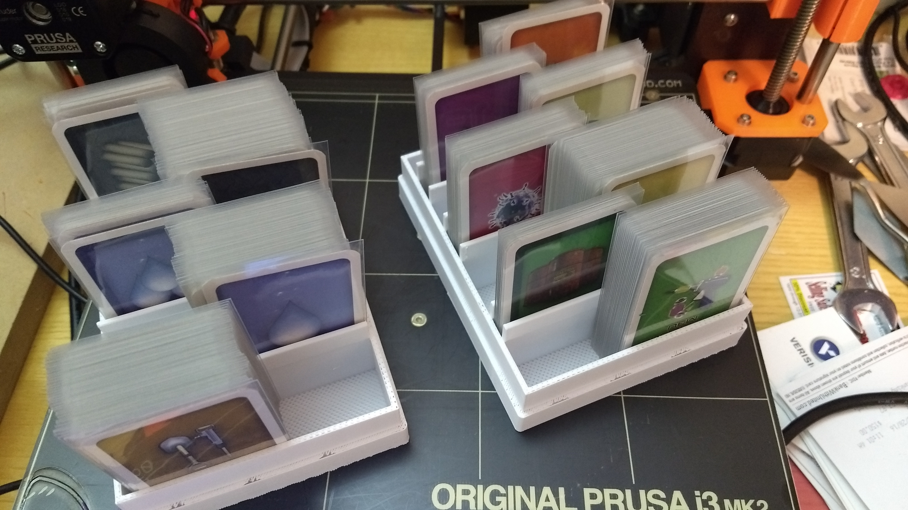
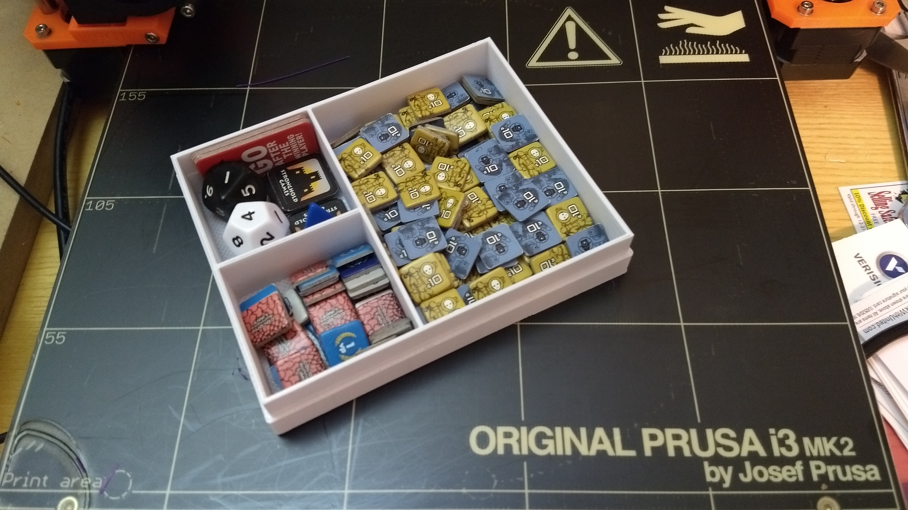

# Outpost Component Boxes

The factories tray and the card trays were optimized for certain arrangements
of tiles and cards. Here are the suggested arrangements.

## Factory Tiles Tray

* Small Tiles
  * (HE) Heavy Equipment (5 stacks)
  * (W) Water (5 stacks)
  * (O) Ore (3 stacks)
  * (RP) Research Production (3 stacks)
  * (L) Laboratory (4 stacks)
* Large Tiles
  * (S) Scientists
  * (OL) Orbital Lab
  * (SS) Space Station
  * (PC) Planetary Cruiser
  * (MB) Moon Base

| S1 | S2 | S3 | S4 | LG |
|:--:|:--:|:--:|:--:|:--:|
| HE | W  | O  | RP | S  |
| HE | W  | O  | RP | OL |
| HE | W  | O  | RP | SS |
| HE | W  | L  | L  | PC |
| HE | W  | L  | L  | MB |

## Card Trays

The production cards are stored on their sides, and rotated to vertical for play.
I suggest alternating them left and right, to make it easier to spot the cards
you need.

* Tray 1 (5 slots)
  1. Ore
  1. Water
  1. Mega Water
  1. Titanium
  1. Mega Titanium
* Tray 2 (7 slots)
  1. New Chemicals
  1. Mega New Chemicals
  1. Research
  1. Microbiotics
  1. Orbital Medicine
  1. Ring Ore
  1. Moon Ore

## Parts Tray

* Robot / Colonist Tiles (large)
* Scorekeeping Tiles (small)
* Dice / Marketing Tiles (small)

