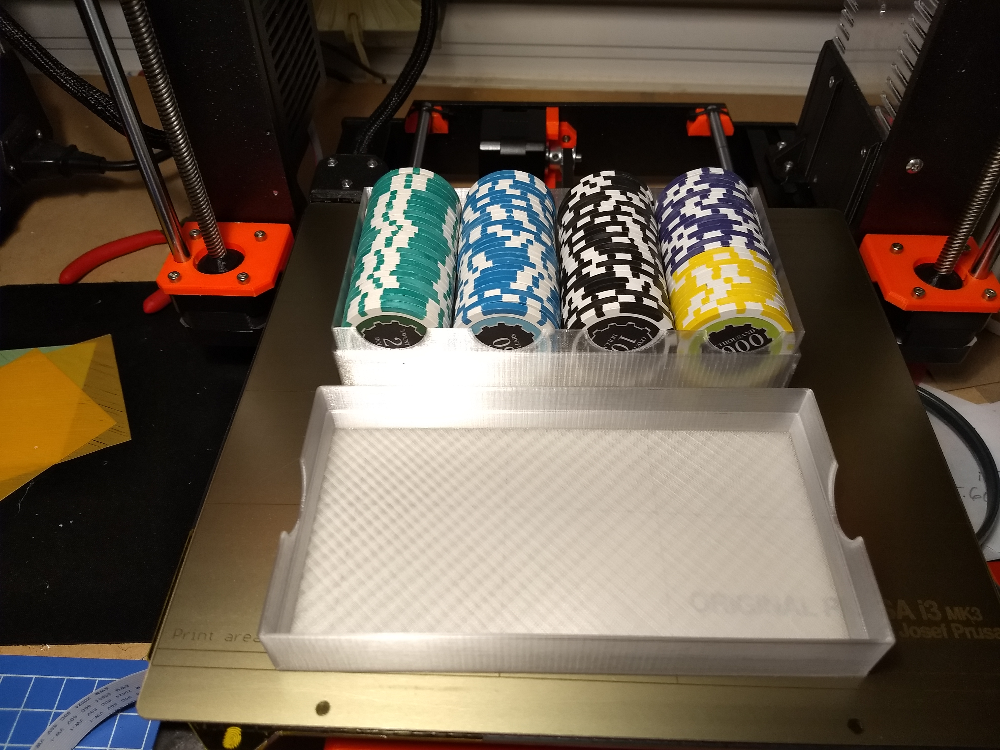

This is a set of printed trays intended for relatively small numbers of poker chips, typically used as money substitutes for board games. 

Ten years ago I purchased a special set of 200 poker chips with solid colors and number amounts printed on the chips, ranging from $1 to $1000. These chips have been ideal substitutes for paper money for any number of board games. I've had many people ask me where I bought them, but the vendor is out of business, and as far as I can tell, no one makes similar money chips.

This is my attempt to reproduce my money chip set using 3D-printed chip trays and custom-ordered poker chip sets. The chip trays are sized for typical 14g poker chips. I prefer sets of 200 chips, though some games may need a different distribution. My original set had the following distribution of chips: (25) $1, (25) $2, (25) $5, (25) $10, (25) $20, (25) $50, (25) $100, (15) $500, (10) $1000.

The cheapest, closest match I could find for the chips was Claysmith Gaming's [Poker Knight Bulk Poker Chips](https://www.claysmithgaming.com/bulk-poker-chips/poker-knights-bulk-poker-chips); the chip distribution is a little different: (25) $1, (25) $2, (25) $5, (25) $10, (25) $25, (25) $100, (25) $500, (25) $1000. The chips in the photo are Brybelly Eclipse chips, which have a slightly different distribution: (50) $1, (25) $5, (25) $10, (25) $20, (25) $50, (25) $100, (15) $500, (10) $1000.

While Claysmith Gaming can sell you acrylic chip trays with lids, their trays are grouped into sets of 20, while they sell chips in groups of 25. So printing my own chip trays seemed the best idea. My trays are sized for 4 rows of 25 chips, so two trays will handle 200 chips. If you need a different arrangement of rows, or have different chip sizes, just download and modify the OpenSCAD model.

Total items to print:

(2) trays  
(2) lids  
