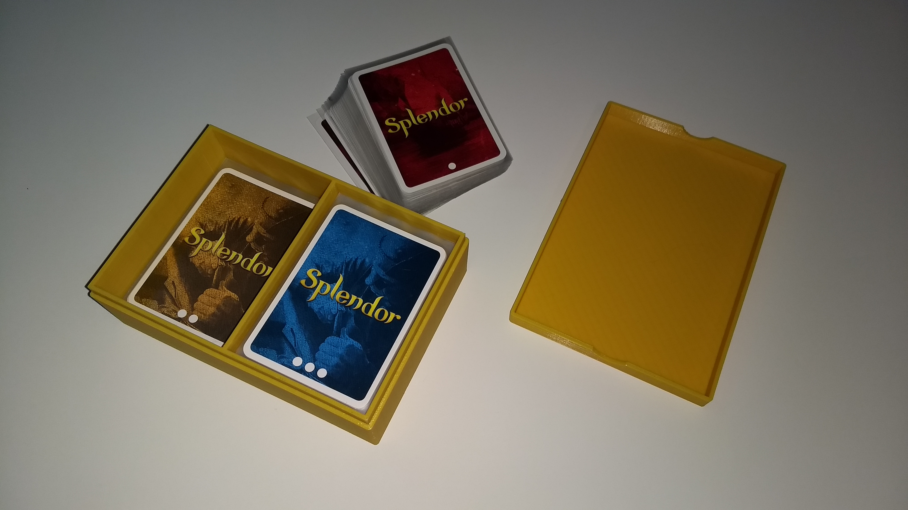
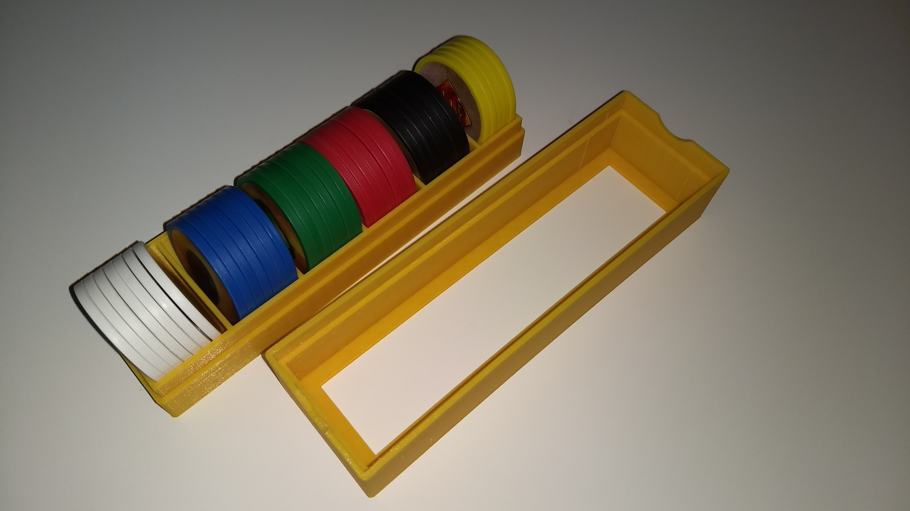
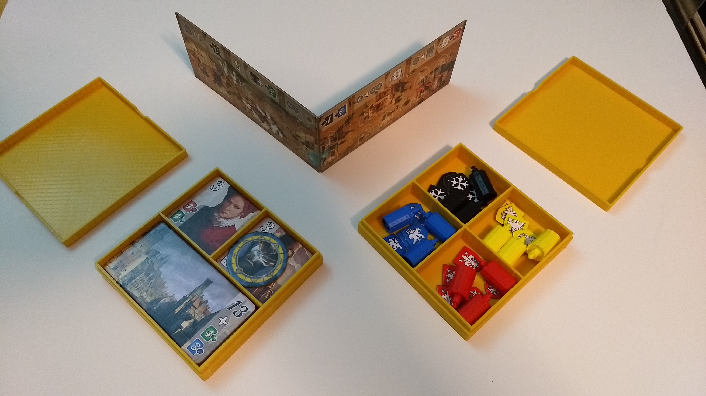
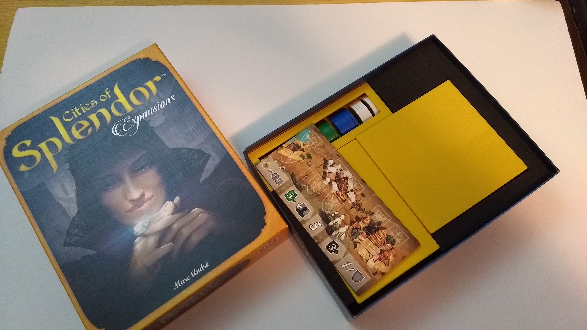

I like to play [Splendor](https://boardgamegeek.com/boardgame/148228/splendor) 
and now that I own [Cities of Splendor](https://boardgamegeek.com/boardgameexpansion/220653/cities-splendor), 
I wanted to organize the game so that all of the parts would fit into a single box.

My solution to organizing this game is as follows:

1. Sleeve all the cards.
1. Use my 3D printer to create boxes (with lids) for the following:
  * All of the cards
    
  * All of the Gems
    
  * All of the Noble and City tiles.
    
  * All of the Strongholds and Trading Post markers.
1. Cut foam to keep the printed boxes from sliding around in the box.

With the boxes and the foam, the Trading Post board will fit on top of the Card and Gem boxes, allowing the rules to fit neatly above all the components.

